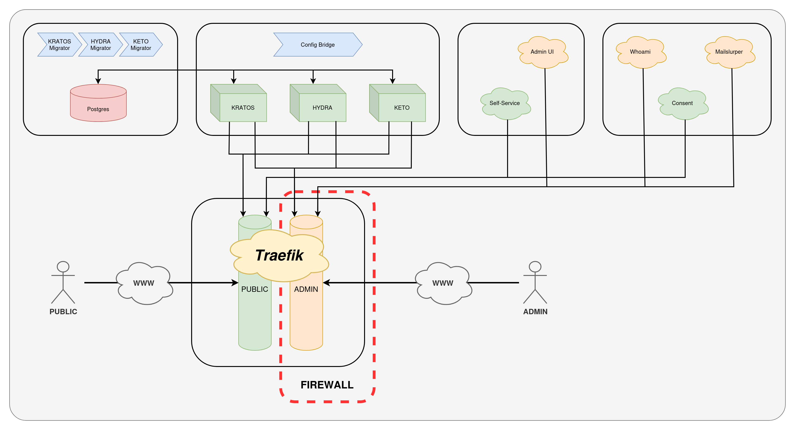

# Foundation-Ory

Foundation-Ory (_foundationally_) is meant to provide a functionally complete IAM solution for basing a production Ory deployment on. Skips over several of the most common pitfalls when setting up an Ory system and provides a modularized approach via Docker Compose and a shared environment file.

## Ory Services

- **Kratos**: State-lite session management
- **Hydra**: State-lite OAuth2.0 server
- **Keto**: Relationship management and permissions validator

## Project Modules

- **Ory**: `docker-compose-ory.yaml` is responsible for managing the core Ory stack members
- **Network**: `docker-compose-net.yaml` sets up a Traefik load balancer to manage the public-facing networking challenges. Handles route assignments, TLS certificates, middleware execution, and Foundation-Ory ships it configured as a strong baseline of network-level security
- **Data**: `docker-compose-pg.yaml` creates a Postgres database (persisted to `/pg`) service for internal services, and then attaches Ory auto-migrators to ensure the cluster is always service-ready for the Ory core stack members.
- **Extras**: `docker-compose-extras.yaml` contains a series of addons to simplify deployment or development of the Ory stack. It ships with:
  - [kratos-selfservice-ui-node](https://github.com/ory/kratos-selfservice-ui-node) for Kratos session flow validation
  - [ory-admin-ui](https://github.com/dhia-gharsallaoui/kratos-admin-ui) for backend administration of the Kratos/Hydra system
  - [mailslurper](https://github.com/mailslurper/mailslurper) as an SMTP mock for validating flows requiring emails
- **Debug**: `docker-compose-debug.yaml` contains a series of small additional services to assist with service bringup and validation. By default it only has one service:
  - [whoami](https://github.com/traefik/whoami) to help validate the initial Traefik deployment
  - [hydra-consent-node](https://www.ory.com/docs/hydra/cli/hydra-perform-authorization-code) for validating Hydra is working with Kratos correctly - mocks an oAuth2 client/server per the "5-minute quickstart" guide

## Architecture Diagram
